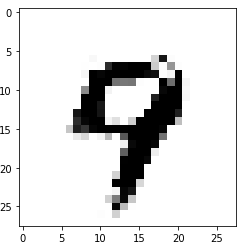

# Gan-from-scratch
This repo contains the code for a gan that has been written from the ground up without using any machine learning frameworks like Tensorflow or Torch!

## Images generated from random noise / latent features:

( for more info on the gan, read the ipynb notebook )
